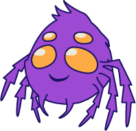

# Twitch Emotes for RIZEN180

### SVG Icon JavaScript Project

I designed 10 emotes/icons for Twitch streamer RIZEN180, whose mascot is a purple spider. I've displayed 10 of the icons here on my page: Hype, Lurk, LOL, Love, Rage, RIP, GG, Smug, WTF, and Dab. 

## Tools Used

My sketchbook, Photoshop CC and Illustrator CC were used to design and create the icons. Sublime Text was used to code the website. 

## Requirements

You will only need an internet browser to be able to see the webpage. 

## Installation

Clone the project, cd to your directory / download, and open the .html file in your browser.

## Author

1. HB (Haley Billson)

## License

MIT